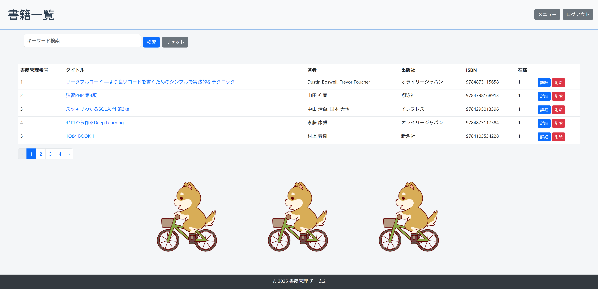

# 📚 書籍管理システム（Laravel製）

このアプリケーションは、**会社で所有する書籍を効率的に管理するためのWebシステム**です。社員が書籍レビューを投稿・共有でき、書籍の登録や在庫管理を行うことで、社内のナレッジ共有や書籍管理の手間を軽減します。

---

## 🛠️ 開発背景

「**会社で所有している書籍の管理システムを Laravel で開発する**」という要件のもと、以下の機能を実装しました。社員の役職（一般社員／総務部）によるアクセス制限や、レビューの個別管理など、実務を想定したロール設計にも対応しています。

---

## 🚩 主な機能

### 👤 共通機能（全社員が利用可能）

#### ✅ 要件

- 📖 書籍一覧の表示（在庫数も確認可能）
- ⭐ 書籍ごとのレビュー一覧の表示
- ✍️ レビューの投稿（おすすめ度：1〜5、コメント）
- ✏️ 自身が投稿したレビューの編集・削除

#### ✨ 追加提案

- 🔍 書籍のキーワード検索機能
- 📦 書籍の在庫数の表示  
- 🔗 書籍詳細から Google Books（外部サイト）へのリンク表示  

---

### 🏢 総務部の社員のみが行える機能

#### ✅ 要件

- ➕ 書籍の新規登録（書籍購入時）

#### ✨ 追加提案

- 🗑️ 書籍の削除  
- 📷 バーコードリーダーを用いた書籍の追加・削除  

---

## 💡 技術的ポイント

- **Laravel**を使用して**MVCモデル**を構築し、保守性と拡張性を意識した設計
- **認可機能**により、「レビューの編集は投稿者のみ可」「書籍登録は総務部限定」などの権限管理を実装
- **セッション管理**で社員の所属情報を保持し、役割ごとの機能制御を実現
- **Eloquent ORM**を用いたリレーション設計で、「書籍：レビュー＝1：多」の構造を明確化

---

## 🎨 UI・装飾

- フッター（コピーライト）を含むページデザイン
- アニメーション画像などを使用した簡易な装飾あり（GIFアイコンなど）

---

## 🔧 開発環境

- Laravel 12.16
- PHP 8.2.12
- XAMPP（ローカル開発用）
- MySQL
- Bootstrap（UI構築）
- Git / GitHub
- ShellScript（各設定コマンド自動実行用）

---

### 🔐 ログインフォーム

ユーザーIDとパスワードを入力してログインします。

---

### 📋 メニュー画面

ログインユーザーの所属（一般社員／総務部）に応じて表示内容が変わります。

  

---

### 📚 書籍一覧画面

書籍のタイトル・著者・在庫数などが一覧表示され、キーワード検索も可能です。

---

### 📖 書籍詳細画面

書籍の詳細情報を表示し、レビューを確認できます。Google Booksへのリンク付きです。

---

### ➕ 書籍追加画面（総務部限定）

新たに購入した書籍を登録するための専用フォームです。バーコードリーダー対応。

---
